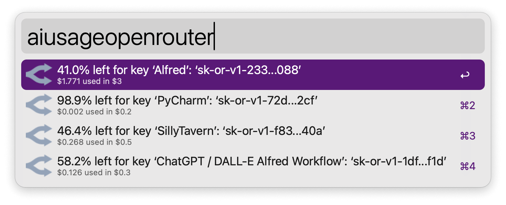
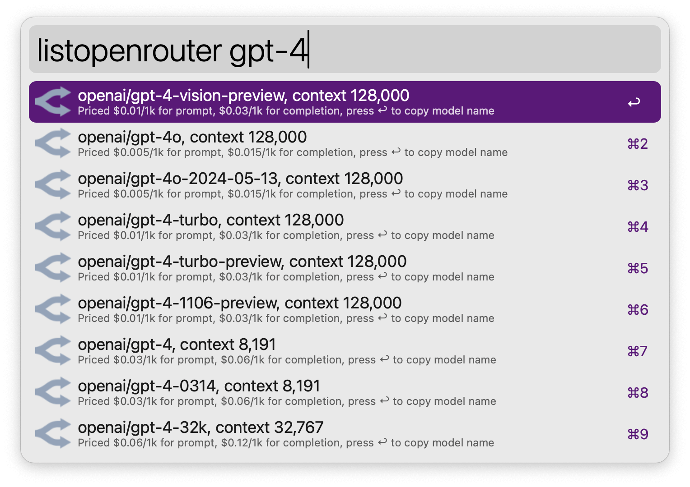
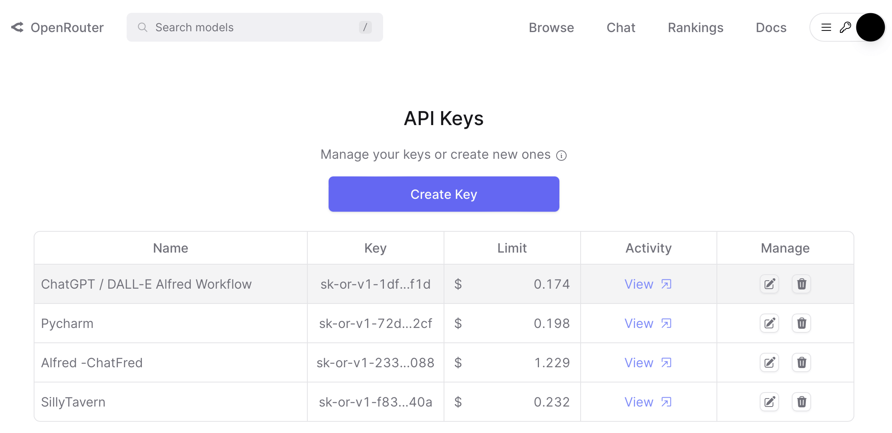
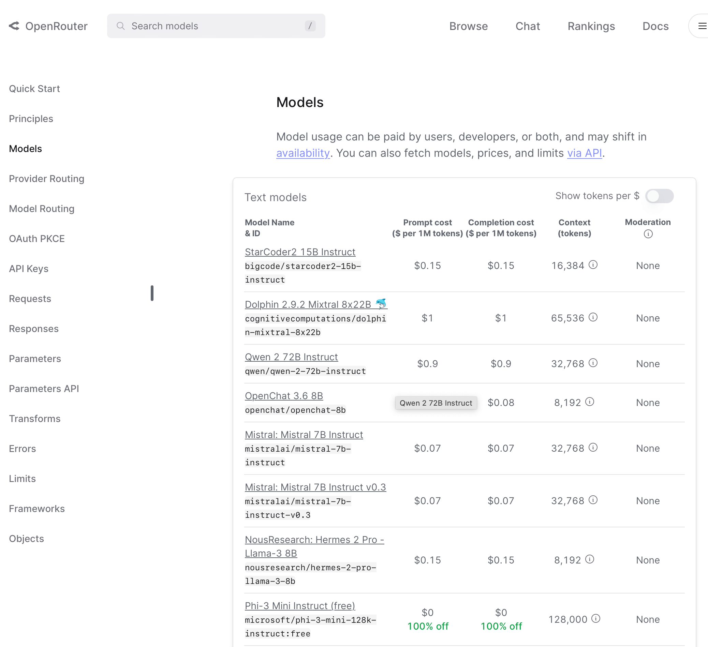
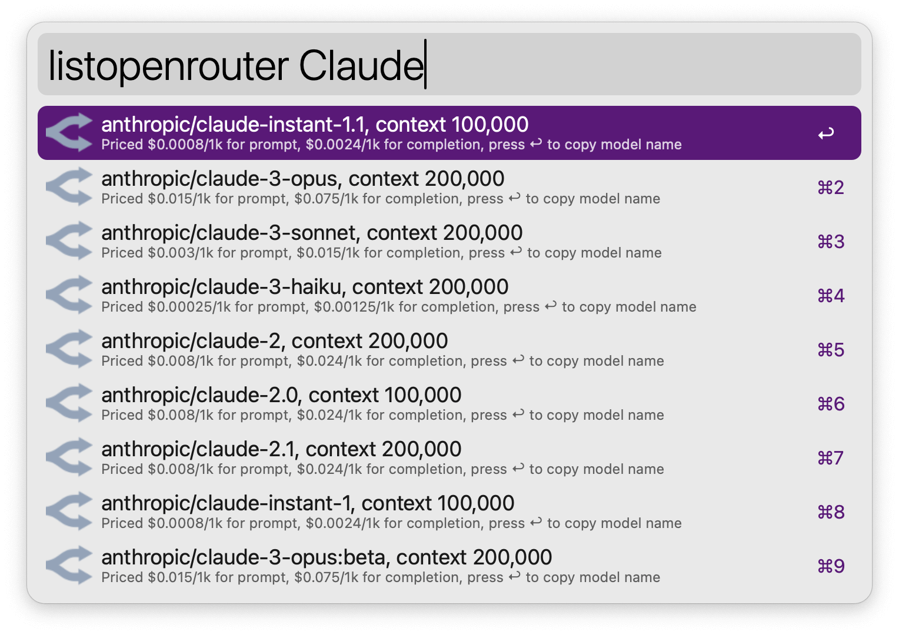
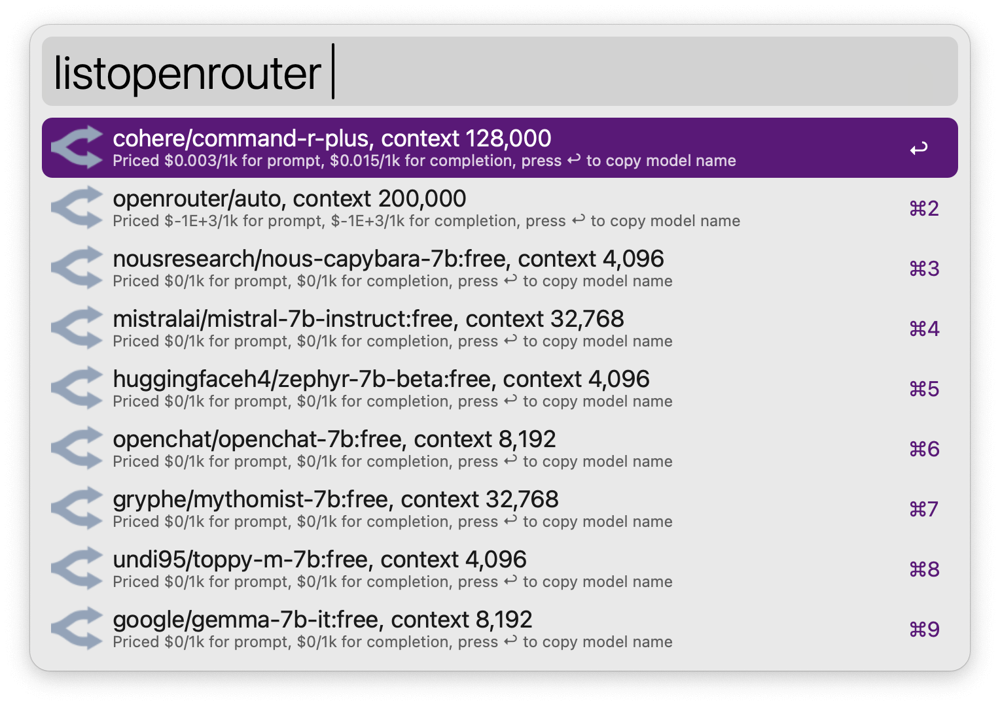

# Query OpenRouter Credit / Available Models

Query your credit usage, models available and their prices on [OpenRouter](https://openrouter.ai), right in Alfred

List available models, with their prices, context length:

Normally you will have to go to the [API Keys page](https://openrouter.ai/keys) and [Docs page](https://openrouter.ai/docs/models) to view these info:

### Setup

Download the workflow from the Release page. Double click to install it in Alfred. 

*You can skip this Setup if you just want to use the ‘List available models’ feature.*

Fill the `OpenRouter API Keys` field with the keys and names of them you want to query. Seperate each name and key with `:`, seperate keys with `;`. Like this: 

`Key Name 1:Your Key 1;Key Name 2:Your Key 2`

Click ‘Install’ or ‘Save’. 

### Usage

#### Query API credit usage

Invoke the `aiusageopenrouter` keyword (configurable behind the ‘Configure workflow…’ button with the ‘Keyword for Querying Usage’ field), wait a few seconds and you should see your Credit usage by API key.

#### List / search available models

Search for available models hosted by OpenRouter by invoking the `listopenrouter` keyword (configurable behind the ‘Configure workflow…’ button with the ‘Keyword for Listing Models’ field) and type the keyword.

Or leave empty for all models:

Press return to copy model name. 

### Requirements and dependencies

This workflows requires Python 3 and the `requests` package (included in workflow) to work. 